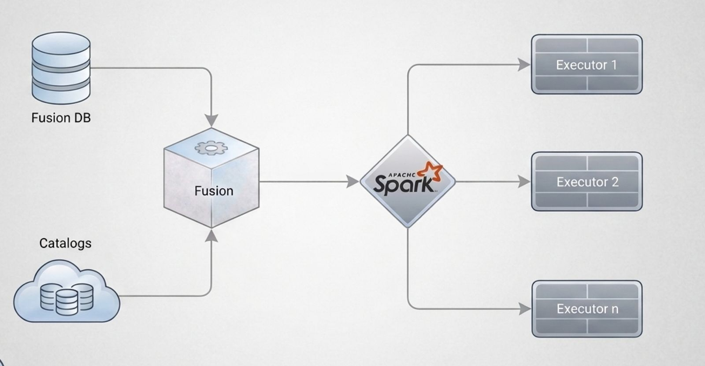

<!--
 - Licensed to the Apache Software Foundation (ASF) under one
 - or more contributor license agreements.  See the NOTICE file
 - distributed with this work for additional information
 - regarding copyright ownership.  The ASF licenses this file
 - to you under the Apache License, Version 2.0 (the
 - "License"); you may not use this file except in compliance
 - with the License.  You may obtain a copy of the License at
 - 
 -     http://www.apache.org/licenses/LICENSE-2.0
 - 
 - Unless required by applicable law or agreed to in writing, software
 - distributed under the License is distributed on an "AS IS" BASIS,
 - WITHOUT WARRANTIES OR CONDITIONS OF ANY KIND, either express or implied.
 - See the License for the specific language governing permissions and 
 - limitations under the License.
 -
 - Modified by Datazip Inc. in 2026
-->

<h1 style="border-bottom: none">
  
   OLake-Fusion
</h1>

  OLake-Fusion is a lakehouse table management system for Apache Iceberg. 
  It helps teams run faster queries, lower storage cost, and operate Iceberg at scale with less effort.

  
  
  
  

## Why OLake-Fusion

Operating Iceberg in production is powerful, but day-2 operations can be expensive and complex.
OLake-Fusion adds an operational layer on top of Iceberg so your team can focus on data products instead of maintenance jobs.

With OLake-Fusion, you can:

- Keep query performance stable with continuous self-optimization.
- Reduce storage and compute waste from small-file and metadata overhead.
- Manage tables consistently across different catalogs and environments.
- Build infra-decoupled, stream-and-batch-fused, lake-native data platforms.

## Architecture

  

- **Fusion (Management Service):** Handles table lifecycle operations such as self-optimization and data expiration, and provides a unified catalog interface across engines.
- **Spark Optimizer:** Runs optimization tasks that improve file layout and maintain read efficiency.

## Key Features

- **Cron Based Table Configuration:** Define cron to run compaction with an easy UI.
- **Multi-Catalog Support:** Works with catalogs such as Glue, JDBC, and REST-based catalogs.
- **Infrastructure Independent:** Deploy on private cloud, public cloud, hybrid cloud, or multi-cloud.
- **Lakehouse Ready:** Designed for modern analytics workloads on open table formats.

## Benchmark Highlights

- Up to **2x faster** than vanilla Spark compaction in benchmark scenarios.
- Around **5% better** query performance in tested workloads.

Read the full benchmark details: [Compaction Benchmark](https://olake.io/docs/benchmarks/compaction/)

## Quick Start

Start with the first end-to-end setup guide:

- [Configure Your First Compaction](https://olake.io/docs/fusion/getting-started/configure-first-compaction/)

Helpful next reads:

- [Deployment Guide Docker](https://olake.io/docs/fusion/install/olake-ui/)
- [Deployment Guide Helm](https://olake.io/docs/fusion/install/kubernetes-compaction/)
- [Managing Catalogs](https://olake.io/docs/fusion/maintenance/catalogs/)

## Community

- Join us on [Slack](https://olake.io/slack/)
- Ask questions and report issues via [GitHub Issues](https://github.com/datazip-inc/olake-fusion/issues)
- Follow docs and updates at [OLake Fusion Docs](https://olake.io/docs/fusion/getting-started/overview/)

## Contributing

Contributions of all sizes are welcome.

- This project: [CONTRIBUTING.md](CONTRIBUTING.md) — build, IDE setup, debug mode, and PR requirements
- Core project: [datazip-inc/olake](https://github.com/datazip-inc/olake/blob/master/CONTRIBUTING.md)
- UI project: [OLake UI Repository](https://github.com/datazip-inc/olake-ui)
- Docs and website: [OLake Docs Repository](https://github.com/datazip-inc/olake-docs/)
- Contributor rewards: [Bounty Program](https://olake.io/docs/fusion/community/issues-and-prs#goodies)
